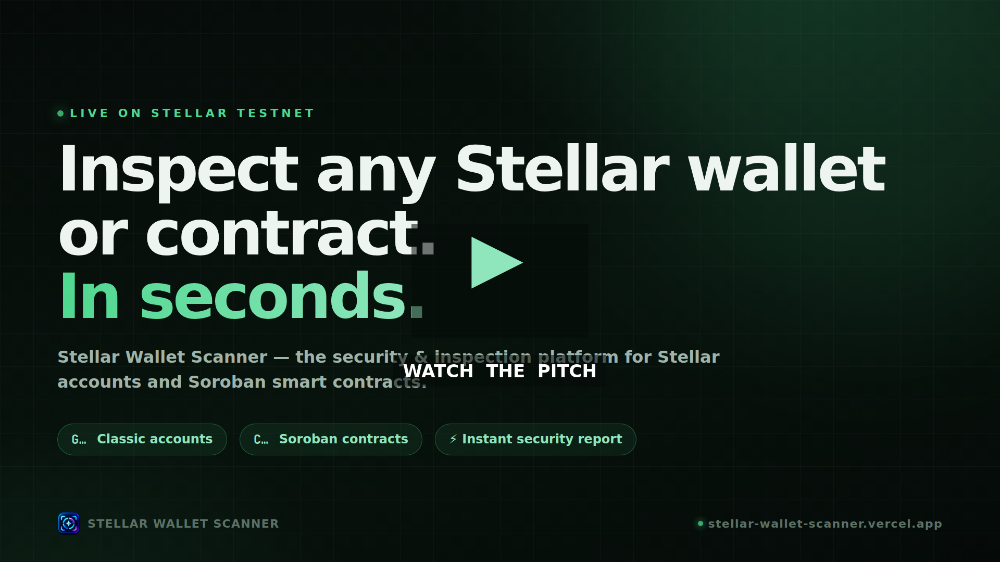

# Stellar Wallet Scanner

<p align="center">
  <a href="https://github.com/Stellar-Wallet-Scanner/stellar-wallet-scanner/releases/tag/pitch-video" target="_blank">
    
  </a>
</p>

<p align="center">
  <a href="https://github.com/Stellar-Wallet-Scanner/stellar-wallet-scanner/releases/tag/pitch-video" target="_blank"></a>
  &nbsp;
  <a href="https://stellar-wallet-scanner.vercel.app" target="_blank"></a>
  &nbsp;
  <a href="https://stellar-wallet-scan.vercel.app/health" target="_blank"></a>
  &nbsp;
  <a href="https://stellar.expert/explorer/testnet/contract/CAK5BORDDC4G3XDU4RBXDJU2PUSHOY4DQMX53ILJKGI2ORP2P5B332VL" target="_blank"></a>
</p>

A professional Stellar Testnet security and blockchain inspection platform for analyzing classic Stellar accounts and Soroban smart contracts.

The application combines a React frontend, Rust backend, Stellar Testnet infrastructure, and a deployed Soroban Scanner Registry smart contract to provide an end-to-end blockchain scanning experience.

---

# 🎬 Product Pitch Video

> **The fastest way to understand this project.** A narrated, 2-minute walkthrough of the problem, the solution, live features, the on-chain registry, and the full architecture — with real captures from the production deployment.

<p align="center">
  <a href="https://github.com/Stellar-Wallet-Scanner/stellar-wallet-scanner/releases/tag/pitch-video" target="_blank">
    
  </a>
</p>

| | |
| --- | --- |
| **▶ Watch now** | [Stream on the release page](https://github.com/Stellar-Wallet-Scanner/stellar-wallet-scanner/releases/tag/pitch-video) |
| **⬇ Download MP4** | [stellar-wallet-scanner-pitch.mp4 (1080p, 56 MB)](https://github.com/Stellar-Wallet-Scanner/stellar-wallet-scanner/releases/download/pitch-video/stellar-wallet-scanner-pitch.mp4) |
| **📋 What's inside** | Problem → Solution → Live account & contract scans → On-chain Scanner Registry → Architecture → Rust contract → Why it's different |

---

## Live Project

### Frontend

https://stellar-wallet-scanner.vercel.app

### Backend

https://stellar-wallet-scan.vercel.app

### Network

Stellar Testnet

---

# Scanner Registry Smart Contract

The project includes a dedicated Soroban smart contract deployed on the Stellar Testnet.

## Contract Address

# `CAK5BORDDC4G3XDU4RBXDJU2PUSHOY4DQMX53ILJKGI2ORP2P5B332VL`

This is the official Scanner Registry contract used by the project.

### View Contract

Stellar Lab:

https://lab.stellar.org/r/testnet/contract/CAK5BORDDC4G3XDU4RBXDJU2PUSHOY4DQMX53ILJKGI2ORP2P5B332VL

Stellar Expert:

https://stellar.expert/explorer/testnet/contract/CAK5BORDDC4G3XDU4RBXDJU2PUSHOY4DQMX53ILJKGI2ORP2P5B332VL

### Deployment Transaction

`20233dc6426cbcc60bc3efb8896ff797195ae3b3b503b943f1f1ae3696554b8d`

### Initialization Transaction

`b2b7c584dd2d9fd8e21574038d803d02909febfa00917bb360d9dd8bc1cd0981`

### WASM Hash

`2ea208de1516be0f27709d54b015b3745d5f5532d4d2c50ca5cb2d5fbcb2e8c7`

### Contract Version

`1.0.0`

---

# Overview

Stellar Wallet Scanner is a blockchain security and inspection platform designed specifically for the Stellar Testnet.

The scanner accepts two major types of Stellar addresses:

- Classic Stellar accounts beginning with `G`
- Soroban smart contracts beginning with `C`

The application detects the address type automatically and routes the request through the appropriate scanning system.

For classic Stellar accounts, the frontend communicates with a Rust backend that retrieves and analyzes account information.

For Soroban contracts, the application inspects contract metadata, WASM information, exported functions, and contract structure.

The platform also includes a Soroban Scanner Registry contract that provides an on-chain registry for the scanner itself.

---

# Key Features

## Stellar Account Scanner

Analyze classic Stellar Testnet accounts beginning with `G`.

The scanner can inspect:

- XLM balance
- Stellar assets
- Token information
- Signers
- Account security information
- Security findings
- Account status
- Testnet funding information

## Soroban Contract Scanner

Analyze Soroban smart contracts beginning with `C`.

The scanner can inspect:

- Contract existence
- Contract instance information
- WASM hash
- WASM size
- WASM validation
- Exported contract functions
- Contract metadata
- Security information

Example contract:

```text
CAK5BORDDC4G3XDU4RBXDJU2PUSHOY4DQMX53ILJKGI2ORP2P5B332VL
```

---

# Soroban Scanner Registry

The project includes a dedicated Soroban smart contract called `ScannerRegistry`.

The contract acts as an on-chain registry for the scanner.

It stores:

- Scanner administrator
- Scanner version
- Scan count

The registry provides a blockchain based source of truth for important scanner metadata.

### Registry Functions

```text
initialize()
get_admin()
get_version()
get_scan_count()
record_scan()
```

The contract is deployed on Stellar Testnet and initialized with:

```text
Version: 1.0.0
Network: Stellar Testnet
```

The registry is displayed directly inside the application so users can verify the deployed scanner contract.

---

# Architecture

```text
                         ┌──────────────────────────┐
                         │      User / Browser      │
                         └────────────┬─────────────┘
                                      │
                                      ▼
                         ┌──────────────────────────┐
                         │      React Frontend      │
                         │      Vite + JavaScript   │
                         └────────────┬─────────────┘
                                      │
                         ┌────────────┴─────────────┐
                         │                          │
                         ▼                          ▼
              ┌─────────────────────┐   ┌─────────────────────┐
              │  Classic Account    │   │   Soroban Contract  │
              │       G...           │   │        C...          │
              └──────────┬──────────┘   └──────────┬──────────┘
                         │                          │
                         ▼                          ▼
              ┌─────────────────────┐   ┌─────────────────────┐
              │    Rust Backend     │   │ Stellar Testnet RPC│
              │     Axum API        │   │     / Contract     │
              └──────────┬──────────┘   └──────────┬──────────┘
                         │                          │
                         ▼                          ▼
              ┌─────────────────────┐   ┌─────────────────────┐
              │ Stellar Testnet     │   │ Scanner Registry    │
              │ Horizon             │   │ Soroban Contract    │
              └─────────────────────┘   └─────────────────────┘
```

---

# Technology Stack

## Frontend

- React
- Vite
- JavaScript
- Tailwind CSS
- Lucide React
- Stellar JavaScript SDK

## Backend

- Rust
- Axum
- Tokio
- Reqwest
- Serde
- Tower HTTP
- Dotenvy

## Blockchain

- Stellar Testnet
- Soroban
- Stellar RPC
- Stellar Horizon
- Stellar JavaScript SDK
- Stellar CLI

## Smart Contract

- Rust
- Soroban SDK
- WASM
- Stellar Testnet

## Deployment

- Vercel
- GitHub

---

# Project Structure

```text
stellar-wallet-scanner/
│
├── backend/
│   ├── src/
│   ├── Cargo.toml
│   ├── Cargo.lock
│   ├── Dockerfile.vercel
│   └── .env
│
├── contracts/
│   ├── Cargo.toml
│   ├── README.md
│   ├── AGENTS.md
│   └── contracts/
│       └── scanner_registry/
│           ├── Cargo.toml
│           ├── Makefile
│           └── src/
│               ├── lib.rs
│               └── test.rs
│
├── public/
│   └── assets
│
├── src/
│   ├── components/
│   │   ├── Dashboard.jsx
│   │   ├── Header.jsx
│   │   ├── Sidebar.jsx
│   │   ├── Scanner.jsx
│   │   ├── ScannerRegistry.jsx
│   │   ├── ScanHistory.jsx
│   │   └── SecurityAnalytics.jsx
│   │
│   ├── services/
│   │   └── stellar.js
│   │
│   ├── App.jsx
│   └── main.jsx
│
├── .env
├── package.json
├── vite.config.js
└── README.md
```

---

# How Scanning Works

## 1. User enters an address

The user enters a Stellar Testnet address.

The application determines whether it is:

```text
G...  → Classic Stellar Account
C...  → Soroban Smart Contract
```

The application uses Stellar address validation rather than relying only on the first character.

## 2. Classic Stellar Account

For a classic account:

```text
User
  ↓
React Scanner
  ↓
Rust Backend
  ↓
Stellar Testnet
  ↓
Account Data
  ↓
Security Analysis
  ↓
Scanner Result
```

The Rust backend handles the account scanning request and communicates with Stellar Testnet infrastructure.

## 3. Soroban Contract

For a Soroban contract:

```text
User
  ↓
React Scanner
  ↓
Stellar Testnet RPC
  ↓
Contract Instance
  ↓
WASM Information
  ↓
Exported Functions
  ↓
Contract Analysis
  ↓
Scanner Result
```

This allows the application to inspect Soroban contracts directly from the frontend using Stellar blockchain infrastructure.

---

# Security Model

The application was designed so that users do not need to provide wallet credentials.

The scanner does not require:

- Wallet login
- Private keys
- Seed phrases
- Transaction signing from the user
- Wallet connection

The application is designed for read and analysis operations.

The Soroban Scanner Registry administrator authorization is kept separate from the frontend.

Private credentials should never be placed inside frontend environment variables or committed to GitHub.

---

# Testnet Funding

The project supports Stellar Testnet wallet funding through Friendbot.

Friendbot is used only for Stellar Testnet accounts.

The funding flow is separate from the Scanner Registry smart contract.

```text
Scanner
    │
    ├── Scan account
    │
    └── Request Testnet funding
              │
              ▼
          Friendbot
              │
              ▼
       Stellar Testnet
```

No mainnet funds are involved in the application's Testnet funding functionality.

---

# Scanner Registry Contract

The Scanner Registry smart contract was written in Rust using the Soroban SDK.

The contract stores its registry data using Soroban instance storage.

The stored information includes:

```text
admin
version
scans
```

Initialization requires administrator authorization.

The contract also prevents the registry from being initialized more than once.

The `record_scan` function requires authorization from the stored administrator before modifying the scan counter.

---

# Smart Contract Tests

The contract includes tests covering:

### Registry initialization

Verifies that the administrator, version and initial scan count are stored correctly.

### Scan recording

Verifies that scan count increments correctly.

### Initialization protection

Verifies that the contract cannot be initialized more than once.

Test result:

```text
running 3 tests

test test::test_initialize_and_read_registry ... ok
test test::test_cannot_initialize_twice ... ok
test test::test_record_scan ... ok

test result: ok

3 passed
0 failed
```

---

# Smart Contract Build

The optimized Soroban contract produces:

```text
WASM:
scanner_registry.wasm

WASM Size:
1197 bytes optimized

WASM Hash:
2ea208de1516be0f27709d54b015b3745d5f5532d4d2c50ca5cb2d5fbcb2e8c7

Exported Functions:
5
```

Exported functions:

```text
get_admin
get_scan_count
get_version
initialize
record_scan
```

---

# Backend API

The Rust backend exposes the following routes.

## Health

```http
GET /health
```

Checks whether the backend service is available.

## Root

```http
GET /
```

Returns backend status information.

## Check Wallet

```http
GET /api/wallet/check/{address}
```

Checks the status of a Stellar Testnet wallet.

## Scan Wallet

```http
POST /api/wallet/scan/{address}
```

Runs the Stellar account security scan.

## Fund Wallet

```http
POST /api/wallet/fund/{address}
```

Requests Stellar Testnet funding where applicable.

---

# Environment Variables

## Frontend

Create a `.env` file:

```env
VITE_BACKEND_URL=http://localhost:8080

VITE_SCANNER_CONTRACT_ADDRESS=CAK5BORDDC4G3XDU4RBXDJU2PUSHOY4DQMX53ILJKGI2ORP2P5B332VL
```

For production, the backend URL should point to the deployed backend.

## Backend

Create a backend `.env` file:

```env
HORIZON_URL=https://horizon-testnet.stellar.org
FRIENDBOT_URL=https://friendbot.stellar.org
AUTO_FUND_BELOW_XLM=0
HOST=127.0.0.1
PORT=8080
FRONTEND_ORIGIN=http://localhost:5173
```

Never commit secrets or private keys to GitHub.

---

# Local Development

## Frontend

Install dependencies:

```bash
npm install
```

Start the frontend:

```bash
npm run dev
```

The Vite development server will normally run at:

```text
http://localhost:5173
```

## Backend

Navigate to the backend:

```bash
cd backend
```

Run the Rust server:

```bash
cargo run
```

The backend will normally run at:

```text
http://127.0.0.1:8080
```

---

# Production Build

Build the frontend:

```bash
npm run build
```

The production files are generated in:

```text
dist/
```

---

# Deployment

The project uses separate Vercel deployments for the frontend and backend.

### Frontend

https://stellar-wallet-scanner.vercel.app

### Backend

https://stellar-wallet-scan.vercel.app

The frontend communicates with the deployed Rust backend through the configured:

```env
VITE_BACKEND_URL
```

---

# Stellar Network

This project currently operates on:

```text
Stellar Testnet
```

Testnet infrastructure:

```text
Horizon:
https://horizon-testnet.stellar.org

Friendbot:
https://friendbot.stellar.org
```

The project is intended for blockchain development, testing, security analysis and demonstration.

---

# Current Contract Deployment

| Property           | Value                                                              |
| ------------------ | ------------------------------------------------------------------ |
| Network            | Stellar Testnet                                                    |
| Contract           | Scanner Registry                                                   |
| Contract Address   | `CAK5BORDDC4G3XDU4RBXDJU2PUSHOY4DQMX53ILJKGI2ORP2P5B332VL`         |
| Version            | `1.0.0`                                                            |
| WASM Hash          | `2ea208de1516be0f27709d54b015b3745d5f5532d4d2c50ca5cb2d5fbcb2e8c7` |
| WASM Size          | `1197 bytes`                                                       |
| Exported Functions | `5`                                                                |
| Network            | Stellar Testnet                                                    |

---

# Design Goals

The project was built around several principles:

### Blockchain Native

Use Stellar and Soroban infrastructure directly rather than simulating blockchain data.

### Security First

Avoid collecting private keys, seed phrases or unnecessary wallet credentials.

### Developer Friendly

Provide a simple interface for inspecting Stellar accounts and Soroban contracts.

### Transparent

Expose the Scanner Registry contract directly in the application so its blockchain deployment can be independently inspected.

### Responsive

The interface is designed for desktop, tablet and mobile screen sizes.

---

# Future Improvements

Potential future improvements include:

- Automatic on-chain recording of successful scans
- Expanded Soroban contract analysis
- Additional security heuristics
- Historical on-chain scanner statistics
- More detailed contract storage inspection
- Additional Stellar asset analysis
- Performance optimization and code splitting
- Expanded automated security testing
- Mainnet read-only support

---

# Project Status

```text
Frontend              Complete
Rust Backend          Complete
Wallet Scanner        Complete
Contract Scanner      Complete
Soroban Registry      Deployed
Contract Tests        Passing
Testnet Integration   Complete
Vercel Deployment     Complete
Responsive UI         Implemented
```

---

# Author

## Moses Ifunanya Nobei

Blockchain Developer | Full Stack Developer | JavaScript Developer | Data Analyst

Specializing in:

- JavaScript
- React
- Node.js
- Rust
- Solidity
- Soroban
- Stellar
- Smart Contracts
- Web3
- SQL
- Data Analysis

---

# License

This project is available for educational, development and demonstration purposes.

See the repository license for applicable terms.

---

# Acknowledgements

Built using the Stellar ecosystem and Soroban smart contract platform.

Special thanks to the Stellar developer ecosystem and open source contributors whose tools and infrastructure make blockchain development on Stellar possible.
