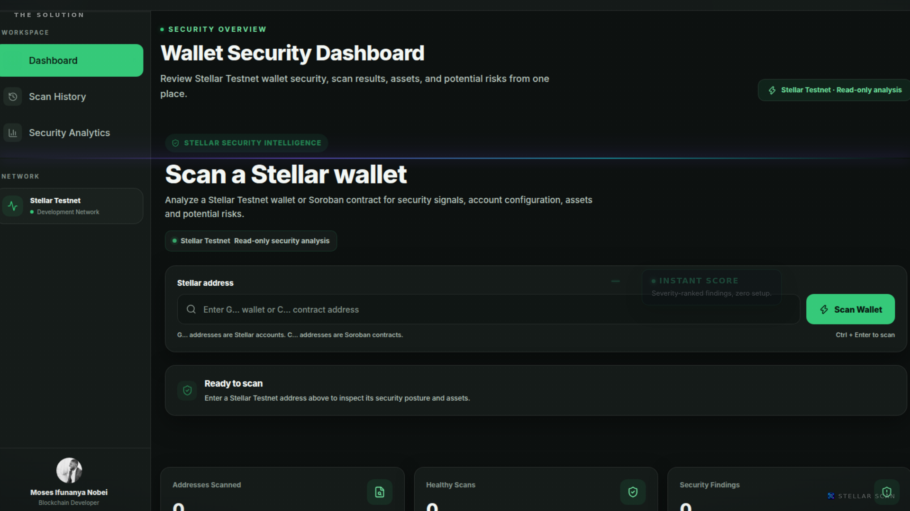

# Stellar Scan

[](https://github.com/mosesifunanya/stellar-wallet-scanner/blob/main/video/out/pitch.mp4)
[](https://stellar-wallet-scanner.vercel.app)
[](https://stellar.org)
[](#license)

<br />

<div align="center">
  <a href="https://github.com/mosesifunanya/stellar-wallet-scanner/blob/main/video/out/pitch.mp4">
    
  </a>
  <p><sub><b>▶ Click the thumbnail to watch the 2-minute product pitch.</b>
  Real UI captures, Gemini voice-over, architecture walkthrough and a live Vercel deployment —
  <a href="#-product-pitch-video">scene-by-scene breakdown</a> below.<br />
  Mirror: <a href="https://gofile.io/d/ad1YDCAe">gofile.io/d/ad1YDCAe</a></sub></p>
</div>

<br />

Stellar Scan is a security intelligence platform for the Stellar ecosystem. It provides read-only analysis of Stellar Testnet accounts and Soroban smart contracts to surface potential security risks through a simple dashboard.

## ✨ Why Stellar Scan

Anyone can paste a Stellar address and — in seconds — know what they are actually interacting with, before trusting it with value:

- **Two address types, one scanner** — wallets (`G...`) *and* Soroban smart contracts (`C...`)
- **Instant security verdicts** — scores plus severity-ranked findings, not a wall of raw chain data
- **Contract risk detection** — inspects deployed WASM, enumerates exported functions, and flags admin / upgrade / pause capabilities (the #1 rug-pull vector)
- **Account configuration audits** — balances, signers, and thresholds flagged when risky
- **Zero-friction** — no wallet connection, no private keys, no transaction signing, no sign-up
- **Local-first history & analytics** — every scan stays in your browser and rolls up into security trends

## 🎬 Product Pitch Video

The 2-minute pitch above is the fastest way to understand the product. What it covers:

> **▶ [Watch the pitch video (stream right on GitHub)](https://github.com/mosesifunanya/stellar-wallet-scanner/blob/main/video/out/pitch.mp4)**
> Direct file: [raw.githubusercontent.com — video/out/pitch.mp4](https://raw.githubusercontent.com/mosesifunanya/stellar-wallet-scanner/main/video/out/pitch.mp4) · Mirror: [gofile.io/d/ad1YDCAe](https://gofile.io/d/ad1YDCAe)

| # | Scene | What you see |
|---|-------|--------------|
| 1 | Cold open | Logo, tagline — *security intelligence for Stellar, in seconds* |
| 2 | The problem | On-chain code holds real value; audits cost $15k+ and weeks |
| 3 | The solution | Paste any Testnet address → instant read-only verdict |
| 4 | Account scan | Live scan scoring a healthy wallet **100/100**, auto-funding flow |
| 5 | Contract scan | Live WASM analysis of a Soroban token — **upgrade path caught** |
| 6 | History & analytics | Local scan history, portfolio-wide security trends |
| 7 | Architecture | React + Vite → Rust/Axum → Stellar RPC, read-only by design |
| 8 | Live demo + CTA | Production Vercel deployment, try-your-own-address |

**▶ [Watch the full pitch video](https://github.com/mosesifunanya/stellar-wallet-scanner/blob/main/video/out/pitch.mp4)** · [Open the live app](https://stellar-wallet-scanner.vercel.app)

## 🖥️ Live Demo

**[stellar-wallet-scanner.vercel.app](https://stellar-wallet-scanner.vercel.app)** — try it right now with any Testnet address:

- Account: `GBVVPXTBPYEOYQJHIIVIOUBFXXSHYSP6GN2XZN56L7VAX7ZNT66WDFSU`
- Soroban contract: `CBIELTK6YBZJU5UP2WWQEUCYKLPU6AUNZ2BQ4WWFEIE3USCIHMXQDAMA`

No setup, no wallet — just paste and scan.

## Features

- Scan Stellar Testnet accounts (`G...`)
- Scan Soroban smart contracts (`C...`)
- Analyze account balances, signers, and thresholds
- Inspect deployed contract WASM
- Detect administrative and upgrade-related capabilities
- Generate preliminary security scores and findings
- Scan history and security analytics
- Dark and light mode
- Responsive interface
- No wallet connection or transaction signing required

## How It Works

```text
Stellar Address
      ↓
Address Detection
      ↓
Account / Smart Contract
      ↓
On-chain Analysis
      ↓
Security Assessment
      ↓
Score & Findings
```

## Architecture

```text
User enters Stellar address
          |
          v
   Address Detection
       /       \
     G...      C...
      |          |
      v          v
Existing or    Soroban
New Account    Contract
      |          |
      v          v
Rust Backend   WASM Analysis
      |          |
      v          v
Account Data   Contract Data
      |          |
      +-----+----+
            |
            v
    Security Assessment
            |
            v
      Score & Findings
```

### Wallet Flow

For a new `G...` Testnet account, the backend can detect that the account is not funded and handle the Testnet funding flow before completing the scan.

For an existing `G...` account, Stellar Scan retrieves the available account information and performs the security analysis directly.

For a `C...` address, the application retrieves the deployed Soroban contract data and analyzes its WASM and exported functions.

## Tech Stack

- React
- Vite
- JavaScript
- Tailwind CSS
- Lucide React
- Stellar SDK
- Soroban
- Stellar Testnet RPC
- Stellar XDR
- Rust backend

## Getting Started

```bash
git clone https://github.com/mosesifunanya/stellar-wallet-scanner
cd stellar-wallet-scanner
npm install
npm run dev
```

Build for production:

```bash
npm run build
```

## Network

Stellar Scan currently operates on Stellar Testnet.

All scanning is read-only.

## Security Notice

Stellar Scan provides preliminary automated security analysis. Detected capabilities are security signals for further investigation and do not automatically indicate that a contract is vulnerable.

It is not a replacement for a professional smart contract audit.

## Privacy

Stellar Scan does not require login, signup, wallet connection, private keys, or transaction signing.

Scan history is stored locally in the browser.

## Roadmap

- Deeper Soroban security analysis
- Improved authorization analysis
- Function-level risk detection
- Advanced security scoring
- Exportable security reports
- Automated contract monitoring

## Author

### Moses Ifunanya Nobei

Blockchain Developer | JavaScript Developer | Data Analyst

- GitHub: https://github.com/mosesifunanya
- LinkedIn: https://www.linkedin.com/in/mosesifunanya/
- X: https://x.com/Ifynob53

## License

Open-source project.
